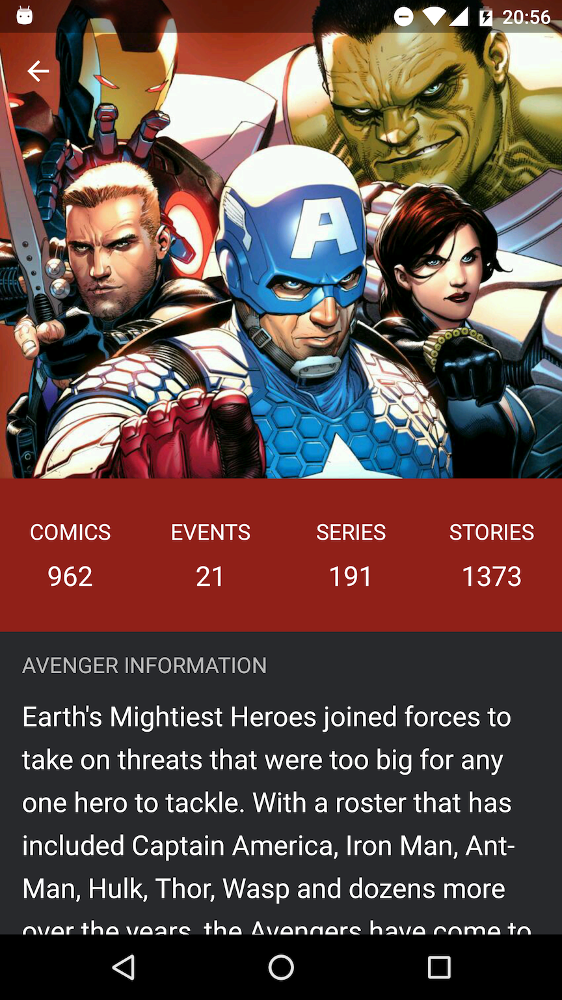

### When Avengers meet Dagger2, RxJava & Retrofit in a clean way

This is the source code of a series focused on giving some basic ideas about how to use [Retrofit](http://square.github.io/retrofit/), [Dagger2](http://google.github.io/dagger/) & [RxJava](https://github.com/ReactiveX/RxJava) together with a [Clean Architecture](http://blog.8thlight.com/uncle-bob/2012/08/13/the-clean-architecture.html).

##### [Part 1 - Dagger 2](http://saulmm.github.io/when-Thor-and-Hulk-meet-dagger2-rxjava-1) 

In this first part it explains how Dagger 2 can help the decoupling of the layers in a project, removing dependencies so that it is easily scalable and testable.

##### [Part 2 - RxJava, RxAndroid, Reactive Extensions & operators](http://saulmm.github.io/when-Iron-Man-becomes-Reactive-Avengers2)

This part focuses on the understanding of what are the Reactive Extensions, its Java implementation, and use RxJava operators, all it integrated with a clean architecture

*NOTE*: The source shown in articles refers to [this release].

#### Screenshots



### License 

```
This Source Code Form is subject to the terms of the Mozilla Public 
License, v. 2.0. If a copy of the MPL was not distributed with this 
file, You can obtain one at http://mozilla.org/MPL/2.0/.
```
